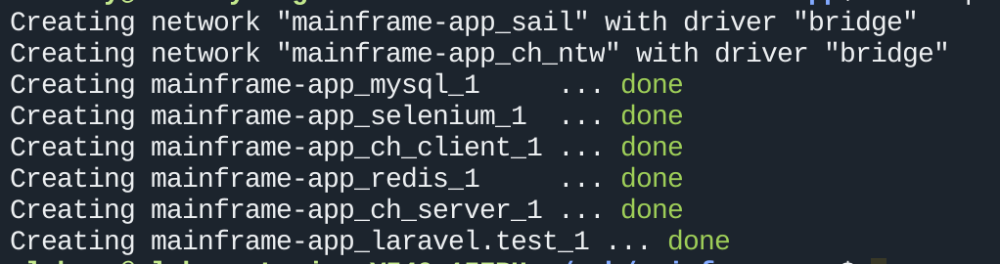
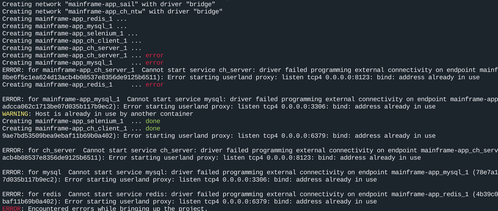

# Setup project
### Install 
- docker
- docker compose
- composer
- node v18.15.0
- npm v9.6.1

# Add to .env

```shell
SAIL_XDEBUG_MODE=develop,debug
```

# Run
```bash
./vendor/bin/sail up -d
./vendor/bin/sail composer install
./vendor/bin/sail npm install 
```

### positive result after command  Sail up -d 


## To migrate MySQL DB run:

```bash
./vendor/bin/sail artisan migrate
```


# Official Doc for Laravel Sail

### EN
https://laravel.com/docs/10.x/sail

# For Linux 
However, instead of repeatedly typing vendor/bin/sail to execute Sail commands, you may wish to configure a Bash alias that allows you to execute Sail's commands more easily:

```bash
alias sail='[ -f sail ] && bash sail || bash vendor/bin/sail'
```

Once the Bash alias has been configured, you may execute Sail commands by simply typing sail. The remainder of this documentation's examples will assume that you have configured this alias:

```bash
sail up
```

### If services are started and an error is returned


```bash
  sudo service apache2 stop
  sudo service mysql stop
```
### if running redis in sistem
```bash
  sudo systemctl stop redis
```


